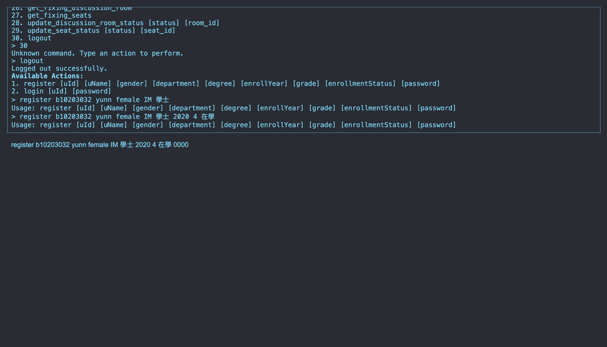

# 113-1db_finalProject

## 簡介

以Node.js 開發圖書館系統。此系統含有書籍借閱、討論/自習室借閱、提供使用者可以新增願望清單以供圖書館參考或採買、書展的舉辦等功能。

## 安裝

請按照以下步驟來安裝和運行此專案：

1. `clone`此儲存庫：
   
   ```sh
   git clone https://github.com/yunn0123/113-1db_finalProject.git
   ```
2. 進入專案目錄：
   
   ```sh
   cd 113-1db_finalProject
   ```
3. 安裝：
   
   ```sh
   npm install
   ```

## 執行

- backend：運行以下命令來啟動node.js：

```sh
npm run dev
```

- frontend：執行`index.html`

## 使用方法

- 使用者：請根據訊息依次輸入使用者訊息以註冊
  
  註冊成功並登入：
  
  根據功能輸入指令即可使用
- 管理者：直接 `login admin passworduwu`做登入
  

